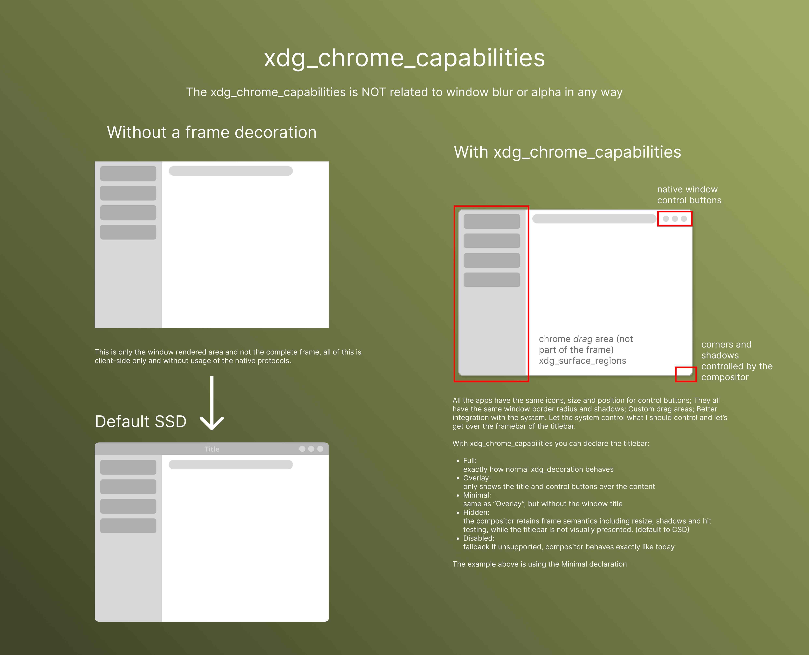

# Walkie Talkie

My own implementation of the Client-Server API on a fast and optimized client program.

Modern chat apps are resource-heavy, closed-source, and often built with Electron, making them inefficient on desktop systems. They are bloated with AI features and trackers to sell your data to other companies; These apps are simply not optimized to be run with high resource usage computers, like in gaming, especially for low end computers; And most importantly, they are closed source.

## Project Status

This project is experimental and under active development. It is not yet intended for daily use. Mostly only the beggining of the backend implemented, optimized multiplatform vulkan powered rendering engines are hard to build.

## Development

None of the options for creating user interfaces for multiplatform pleased me, so I'm doing one from scratch using the Vulkan rendering API and the native calls from macOS, android, windows and linux. The main objective is to create something minimalistic portable and native in all platforms and desktops. I want to be able to use those crates on other projects as well and in the future, move them to their own repo.


### Linux

Different from windows, macOS and android, the linux implementation has a lot of checks in runtime. By default it would be preferable to use server side decorations everywhere, but since some DEs like Gnome don't offer support for the XDG_DECORATION wayland protocol, checking the necessity to render a CSD it's not an option. For now I don't bother to create a CSD, but the option is avaliable and maybe someday I will implement it.

### Vulkan

To create more compatibility between different systems (mainly macOS), vulkan will not be statically linked to the program, instead it will be loaded at runtime.

## Build

The main crates to build the UI are avaliable on `./crates/app`, `./crates/renderer` and `./crates/gui`. To build yourself the app from the source you just need to use `cargo build --release`, but for now there's no packaging avaliable for any platform.

### MacOS

On MacOS you will need to install the vulkan SDK to be able to build the program. Make sure you have `VULKAN_SDK=/opt/homebrew/lib/libvulkan.dylib` set and `/opt/homebrew/bin` on your PATH.

### Linux

On linux there are some packages that you will need to compile this project. Make sure you have installed `clang`, `build-essential`, `lld`, `libvulkan-dev`, `vulkan-tools` and `vulkan-validation-layers`. To build for linux simply use `cargo build-linux-x64`

### GNOME

GNOME has a specific build with limited features. Most of the protocols implemented in the app aren't supported by gnome as their team design choice, to respect that this program includes a specific build for it. To compile yourself, simply use `cargo build-gnome-x64` for x86_64 or `cargo build-gnome-a64` for aarch64.

### Android

To build for android, make sure that the android sdk and ndk are installed and configured on your machine. You wont be able to compile the program without them. Then you can just use `cargo android-build`.

## Wayland Protocols I want to support on 'Linux'

supported DE's:

- KDE (primary focus)
- GNOME (separate bin)
- COSMIC
- SWAY
- HYPRLAND

| source                                              | name                    | DE support             |
|-----------------------------------------------------|-------------------------|------------------------|
| https://wayland.app/protocols/xdg-dialog-v1         | xdg_dialog              | KDE / Hyprland / GNOME |
| https://wayland.app/protocols/linux-drm-syncobj-v1  | linux-drm-syncobj       | ALL                    |
| https://wayland.app/protocols/cursor-shape-v1       | cursor-shape            | All                    |
| https://wayland.app/protocols/wayland-protocols/461 | xdg_decoration_theme    | Not implemented        |
| https://wayland.app/protocols/wayland-protocols/449 | xdg_surface_shape       | Not implemented        |
| None                                                | xdg_chrome_capabilities | Not implemented        |

### xdg_chrome_capabilities

Idea similar to cocoa functionallity with the Quartz compositor on apple, but the implementation doesn't relly on the client side decoration like on apple, insted it asks _politely_ to the server to handle that.

```Rust
window.setTitlebarAppearsTransparent(true);
window.setTitleVisibility(NSWindowTitleVisibility(1));
```
code from './crates/app/src/platform/cocoa.rs'

The best of both CSD and SSD, no anoying title bar using vertical space and native decorations.
Currentlly on wlroots local test.

