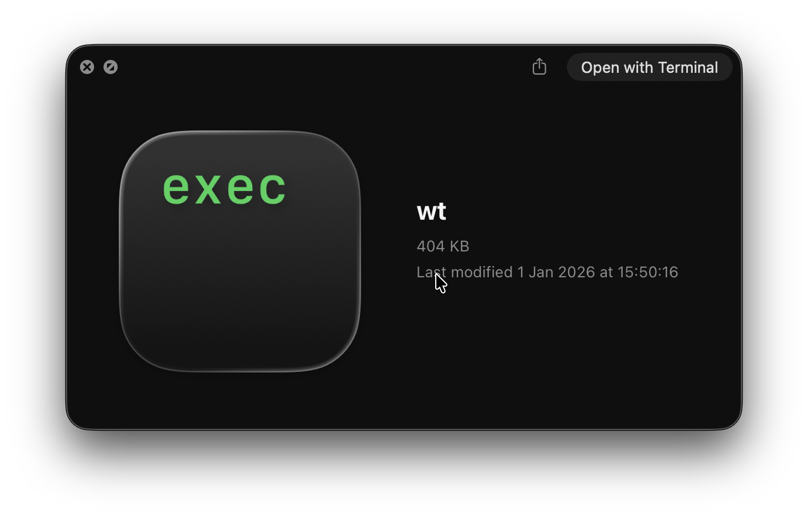

# Walkie Talkie

My own implementation of the Client-Server API on a fast and optimized client program.

Modern chat apps are resource-heavy, closed-source, and often built with Electron, making them inefficient on desktop systems. They are bloated with AI features and trackers to sell your data to other companies; These apps are simply not optimized to be run with high resource usage computers, like in gaming, especially for low end computers; And most importantly, they are closed source.

## Project Status

This project is experimental and under active development. It is not yet intended for daily use. Mostly only the beggining of the backend implemented, optimized multiplatform vulkan powered rendering engines are hard to build.

## Development

None of the options for creating user interfaces for multiplatform pleased me, so I'm doing one from scratch using the Vulkan rendering API and the native calls from macOS, android, windows and linux. The main objective is to create something minimalistic portable and native in all platforms and desktops. I want to be able to use those crates on other projects as well and in the future, move them to their own repo.

- Always remember to use `nix develop` before trying anything!
- Avoid unsafe code on crates other than 'dirty'

### Build

The main crates to build the UI are avaliable on `./crates/app`, `./crates/renderer` and `./crates/gui`. To build yourself the app from the source you just need to use `cargo release-package`, this will compile to your specific archtecture and package it to the most adequate package to your platform.

- [linux](./doc/build/LINUX.md)
- [macos](./doc/build/MACOS.md)
- [windows](./doc/build/WINDOWS.md)
- [android](./doc/build/ANDROID.md)
- [BSD](./doc/build/BSD.md)
- [redoxOS](./doc/build/REDOX.md)
- [LiteOS](./doc/build/LITEOS.md)

### Vulkan

To create more compatibility between different systems (mainly macOS), vulkan will not be statically linked to the program, instead it will be loaded at runtime.
